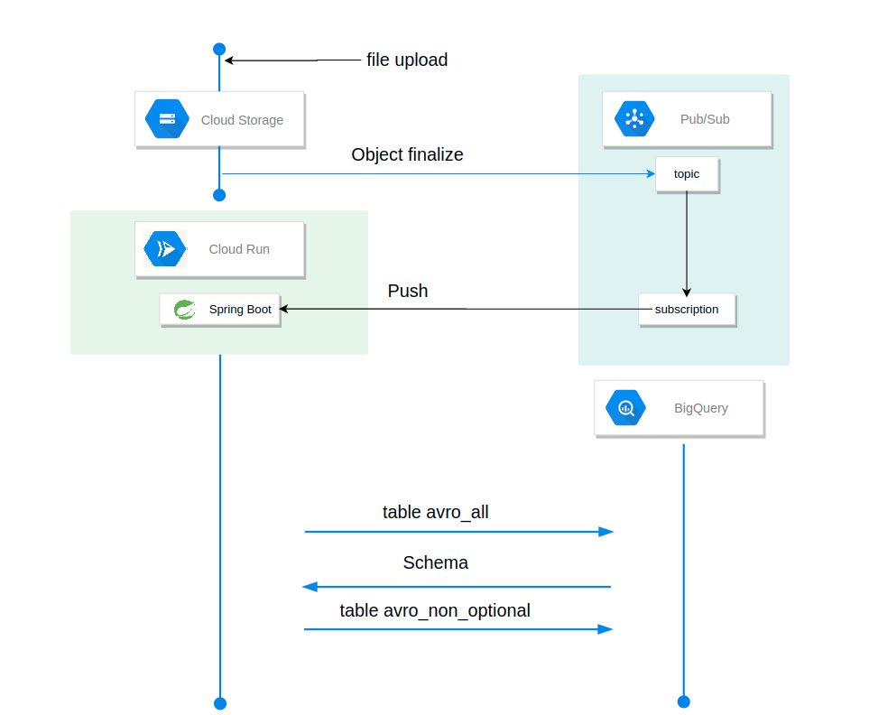
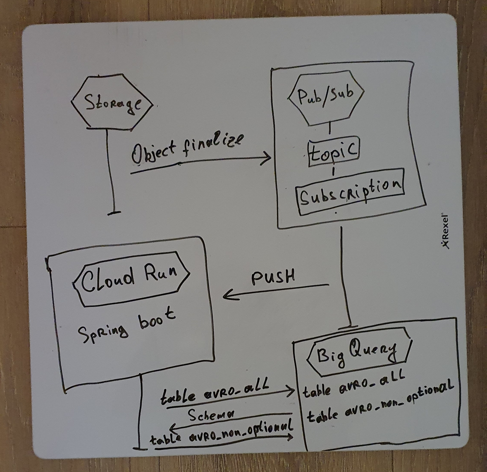

Main idea:
When file uploaded to Cloud Storage notify PubSub Topic with event object finaleze and that subscription through push invoke metod of spring boot spinning on Cloud Run. 
Spring checks Cloud Storage for files with .avro extension, precess them to two self explained tables(avro_all and avro_non_optionl). It can be changed to preccess only files that was uploaded, that info can be obtained from topic message.
At first all data to avro_all, then get schema from this table and filter it for non optional (REQUIRED) fileds, and add required data to avro_non_optional table;
Then processed files been delete from Cloud Storage and wait for new files.

In a more cosy way :)

