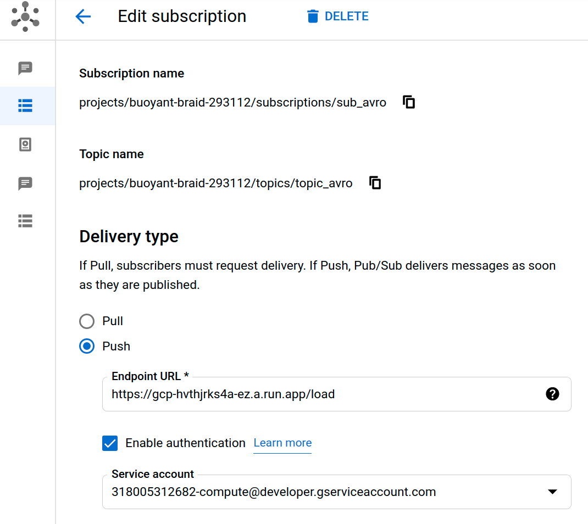
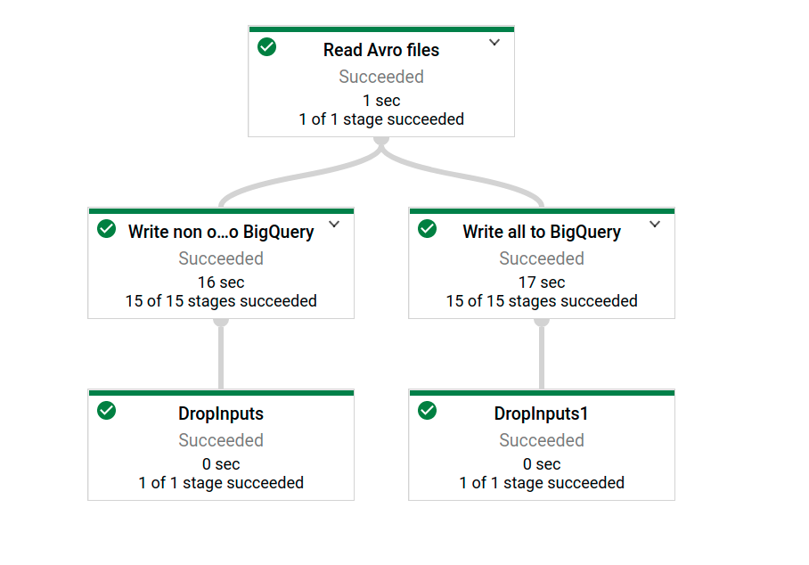

Main idea:

Description:

Notify Pub/Sub PUSH subscription invoked by event object finalize at Cloud Storage invokes spring endpoint running at Cloud Run. Spring processes POST message, gets file name and generation from body, using avro maven library gets corresponding blob, gets schema for all field, process and convert it to schema for non optional field and produce two self explained tables(avro_all and avro_non_optionl). Finally, the avro file is removed from the repository.

Dataflow approach:

